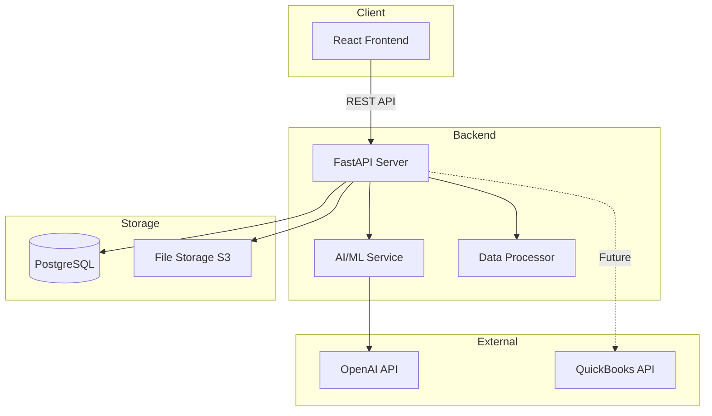

# System Architecture

## High-Level Architecture



## Frontend Architecture

### Technology Stack
- **React 18**: Component-based UI framework
- **TypeScript**: Type-safe development
- **Vite**: Fast build tool and dev server
- **TailwindCSS**: Utility-first CSS framework
- **React Router**: Client-side routing
- **Recharts**: Data visualization library
- **Axios**: HTTP client for API calls

### Directory Structure
```
frontend/
├── src/
│   ├── components/          # Reusable UI components
│   │   ├── dashboard/      # Dashboard-specific components
│   │   ├── charts/         # Chart components
│   │   ├── forms/          # Form components
│   │   └── common/         # Shared components (buttons, cards, etc.)
│   │
│   ├── pages/              # Page-level components
│   │   ├── Dashboard.tsx   # Executive dashboard
│   │   ├── Projects.tsx    # Project list and details
│   │   ├── Reports.tsx     # Financial reports
│   │   └── Upload.tsx      # Data upload interface
│   │
│   ├── services/           # API service layer
│   │   ├── api.ts          # Axios instance configuration
│   │   ├── projectService.ts
│   │   ├── reportService.ts
│   │   └── uploadService.ts
│   │
│   ├── types/              # TypeScript type definitions
│   │   ├── project.ts
│   │   ├── financial.ts
│   │   └── api.ts
│   │
│   ├── utils/              # Utility functions
│   │   ├── formatters.ts   # Number, date, currency formatting
│   │   ├── validators.ts   # Input validation
│   │   └── helpers.ts      # Generic helper functions
│   │
│   ├── hooks/              # Custom React hooks
│   │   ├── useProjects.ts
│   │   └── useFinancials.ts
│   │
│   ├── assets/             # Static assets
│   │   ├── images/
│   │   └── icons/
│   │
│   ├── App.tsx             # Root component
│   └── main.tsx            # Application entry point
│
├── public/                 # Public static files
├── index.html
├── package.json
├── tsconfig.json
├── vite.config.ts
└── vercel.json            # Vercel deployment config
```

### Component Architecture Principles
- **Atomic Design**: Small, reusable components
- **Container/Presenter Pattern**: Separate logic from presentation
- **Type Safety**: Strict TypeScript usage
- **Performance**: React.memo, useMemo, useCallback where appropriate

## Backend Architecture (Planned)

### Technology Stack
- **FastAPI**: Modern Python web framework
- **Pydantic**: Data validation
- **SQLAlchemy**: ORM for database operations
- **Alembic**: Database migrations
- **Python 3.11+**: Latest Python features

### Directory Structure (Planned)
```
backend/
├── app/
│   ├── api/                # API endpoints
│   │   ├── routes/
│   │   │   ├── projects.py
│   │   │   ├── uploads.py
│   │   │   └── reports.py
│   │   └── deps.py         # Dependencies
│   │
│   ├── core/               # Core functionality
│   │   ├── config.py       # Configuration
│   │   ├── security.py     # Authentication
│   │   └── logging.py
│   │
│   ├── services/           # Business logic
│   │   ├── ai_extractor.py # AI data extraction
│   │   ├── pdf_parser.py   # PDF processing
│   │   └── excel_parser.py # Excel processing
│   │
│   ├── models/             # Database models
│   │   ├── project.py
│   │   ├── transaction.py
│   │   └── user.py
│   │
│   ├── schemas/            # Pydantic schemas
│   │   ├── project.py
│   │   └── transaction.py
│   │
│   └── db/                 # Database
│       ├── base.py
│       └── session.py
│
├── tests/
├── alembic/                # Database migrations
├── requirements.txt
└── main.py                 # Application entry point
```

## Data Flow

### 1. Data Upload Flow
```
User uploads file → Frontend validates file
→ Send to Backend API → Store in S3
→ Queue for processing → AI Extraction Service
→ Validate extracted data → Store in PostgreSQL
→ Notify frontend → Update UI
```

### 2. Dashboard Data Flow
```
Frontend requests data → Backend API
→ Query PostgreSQL → Aggregate/calculate metrics
→ Return JSON response → Frontend renders charts
```

### 3. Report Generation Flow
```
User requests report → Backend API
→ Fetch data from DB → Apply formatting/calculations
→ Generate PDF/Excel → Store in S3
→ Return download link → User downloads
```

## Database Schema (Planned)

### Core Tables
- **users**: User accounts and authentication
- **projects**: Construction projects
- **transactions**: Financial transactions
- **budgets**: Project budgets
- **subcontractors**: Subcontractor information
- **invoices**: Invoice records
- **uploads**: Uploaded files metadata
- **reports**: Generated reports

### Relationships
- User → Projects (one-to-many)
- Project → Transactions (one-to-many)
- Project → Budgets (one-to-one)
- Project → Subcontractors (many-to-many)

## API Design Principles

### RESTful Endpoints
```
GET    /api/v1/projects          # List projects
POST   /api/v1/projects          # Create project
GET    /api/v1/projects/{id}     # Get project details
PUT    /api/v1/projects/{id}     # Update project
DELETE /api/v1/projects/{id}     # Delete project

POST   /api/v1/uploads           # Upload file
GET    /api/v1/uploads/{id}      # Get upload status

GET    /api/v1/reports/income-statement/{project_id}
GET    /api/v1/reports/balance-sheet/{project_id}
GET    /api/v1/reports/cash-flow/{project_id}
```

### Response Format
```json
{
  "success": true,
  "data": { ... },
  "message": "Operation successful",
  "errors": null
}
```

## Deployment Strategy

### Frontend (Vercel)
- Automatic deployments from GitHub main branch
- Preview deployments for pull requests
- Environment variables for API endpoints
- CDN distribution for static assets

### Backend (Future - AWS/Railway)
- Containerized deployment (Docker)
- Auto-scaling based on load
- Load balancer for high availability
- Separate staging and production environments

### Database (Future - Managed PostgreSQL)
- Automated backups
- Point-in-time recovery
- Read replicas for scaling
- Connection pooling

## Security Architecture

### Frontend
- HTTPS only
- Content Security Policy headers
- XSS protection
- CSRF token validation

### Backend (Planned)
- JWT-based authentication
- Role-based access control (RBAC)
- Rate limiting
- Input validation and sanitization
- SQL injection prevention (via ORM)
- File upload validation

### Data Storage
- Encryption at rest
- Encryption in transit (TLS)
- Secure credential management (environment variables)
- Regular security audits

## Performance Optimization

### Frontend
- Code splitting and lazy loading
- Image optimization
- Caching strategies
- Minification and compression

### Backend (Planned)
- Database query optimization
- Redis caching for frequent queries
- Background job processing (Celery)
- API response compression

## Monitoring & Logging (Future)

### Application Monitoring
- Error tracking (Sentry)
- Performance monitoring
- User analytics
- API request logging

### Infrastructure Monitoring
- Server health checks
- Database performance metrics
- API response times
- Error rates and alerts
